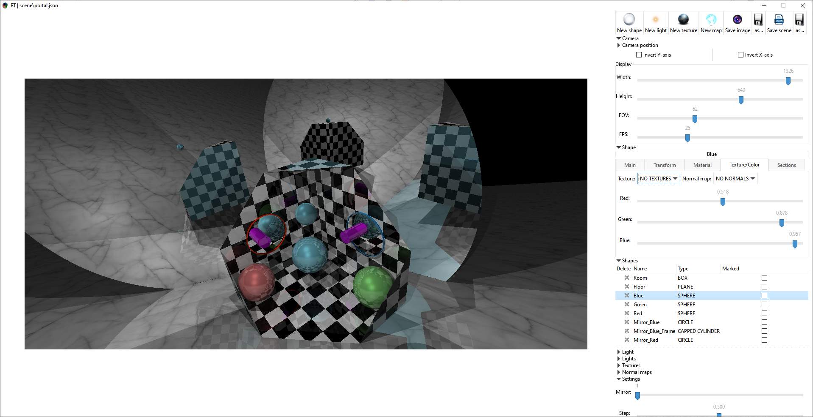
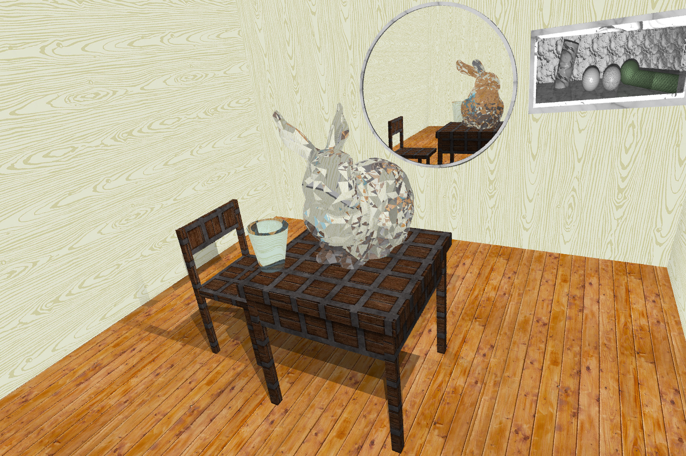

# RT
# Ray-Tracing application with GUI

## Preparing

To run this project you will need an **OpenCL** and **GTK3+**.

OpenCL - for GPU calculation.

GTK3+ - for GUI.

## Compilation and Run

Execute `make` for compilation

Execute `make run` for Running app

## Examples

For more examples of GUI look at [GUI screenshots](./extras/app/)

For more examples of Scenes look at [scene screenshots](./extras/images/), [scene JSON files](./scene/) which you can open by app.

Examples of [normalmaps for shapes](./extras/normalmaps/), [textures for shapes](./extras/textures/), [multi triangle objects](./extras/off/) like bunny at next picture

